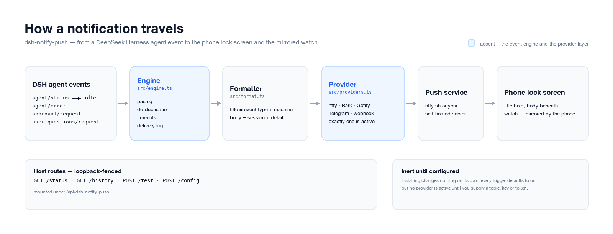
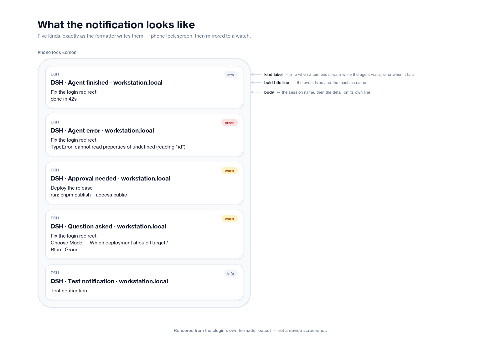
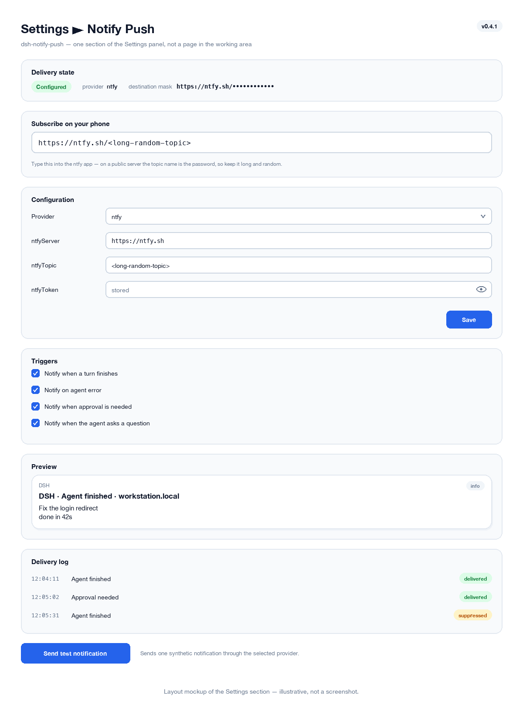

# dsh-notify-push
把 DeepSeek Harness 的 agent 通知推送到手机和手表：支持 ntfy、Bark、Gotify、Telegram 以及自定义 webhook，无需一直开着浏览器标签页。
[English](README.md) | **简体中文**

[](LICENSE)
[](https://github.com/icrefin/dsh-notify-push/releases/tag/v0.4.1)
[](https://github.com/icrefin/dsh-notify-push/actions/workflows/ci.yml)
[](https://github.com/icrefin/dsh-notify-push/commits/main)
[](https://github.com/icrefin/dsh-notify-push/stargazers)
[](https://github.com/icrefin/dsh-notify-push/pulls)
[](https://nodejs.org)
[](https://github.com/deepseek-ai/deepseek-harness)

这是一个 [DeepSeek Harness](https://github.com/deepseek-ai/deepseek-harness)（dsh）
插件。每当 agent 结束一轮对话、报错，或者正在等你审批时，它都会把一条
简短通知推送到你的**手机**——再借助手机自身的通知镜像，传到你的**手表**。

与浏览器通知不同，这条通知会离开本机：它经由网络发往你选定的推送服务，
因此即使 Harness 标签页已经关闭、笔记本已经合盖，它依然能送到。

```
Settings ▸ Notify Push                          v0.4.1
└── 投递状态、可编辑的配置表单、
    需要订阅的服务器和 topic（原样给出）、
    已启用的触发条件、实时预览、投递日志，
    以及一个「发送测试通知」按钮
```

它只是设置面板里的一个区块，而不是工作区中的一个页面：通知器配置一次、偶尔
瞥一眼，给它一个常驻的侧边栏图标和一整列中间区域是用力过猛。触发入口、
导航项、面板和滚动容器都由设置外壳（Settings shell）提供，因此本插件只贡献
区块主体——刻意不带 `height`、不带第二层滚动、也不带水平内边距，这些外壳
都已经给了。

标题旁的版本号是**运行时**从 manifest 读取的，而不是构建时写死的，所以它
标明的是 harness 实际加载的那份构建。这一点很重要：安装一个新包并不会重新
组合正在运行的 profile——磁盘上的替换在重启前不会生效，而这枚版本标签是
区分这两种状态最快的方式。

## 一条通知包含什么

每条通知都以固定的结构携带同样的三项事实：

| 组成 | 位置 | 示例 |
|---|---|---|
| **事件类型** | 标题 | `Agent finished` |
| **主机** | 标题 | `workstation.local` |
| **会话** | 正文第 1 行 | `Fix the login redirect` |
| **细节** | 正文第 2 行 | `done in 42s` |

所以锁屏上读到的是：

```
Agent finished · workstation.local
Fix the login redirect
done in 42s
```

事件类型是 `Agent finished`、`Agent error`、`Approval needed`、
`Question asked` 或 `Test notification` 之一。当你在跑不止一个 Harness 时，
`titlePrefix` 会在前面加一段字面量（`DSH · …`）。

`Question asked` 通知会带上问题本身，而不只是「有问题存在」这件事：一条只写着
「agent 有问题」的提示，会逼你打开应用才能判断它到底要不要紧：

```
Question asked · workstation.local
Fix the login redirect
Choose Mode — Which deployment should I target?
Blue · Green
```

标题、问题，以及（选项不多时）给出的候选，都在锁屏上，足以让你判断要不要
现在就回答。较长的问题会在这里被截断，并带一个可见的省略号，而不是留给
操作系统从单词中间切开。

## 截图


*事件如何抵达你的手机：engine 负责限速与去重，formatter 组装两行文本，provider 负责投递。*


*由本插件自己的 formatter 输出渲染而成——就是那两行标题与正文的原始字符串，按它们在锁屏上出现的样子展示。不是设备截图。*


*「**设置 ▸ 通知推送**」区块的布局稿（示意，不是截图）。*

## 对外接口

| 接口 | 作用 |
|---|---|
| Host 路由 `GET /api/dsh-notify-push/status` | provider、投递目标、已启用的触发条件、计数器、实时预览、表单描述符 |
| Host 路由 `GET /api/dsh-notify-push/history` | 最近的投递日志 |
| Host 路由 `POST /api/dsh-notify-push/test` | 发送一条合成的测试通知 |
| Host 路由 `POST /api/dsh-notify-push/config` | 把校验过的设置合并进本行的 config |
| 设置区块 **Notify Push** | 全部界面：状态、表单、订阅信息、预览、日志和测试按钮 |

只有一次 slot 注册，注册进 `settings.section`——这是
`@deepseek-ai/dsh-client-ui-settings-general` 声明的一个 `list` slot，其条目
携带 `{ id, order, label }`，外壳会在自己的滚动面板中渲染当前激活的那一条。
`dsh.client.inject` 同时声明了该包和 `@deepseek-ai/dsh-client-ui-settings`，
后者拥有规范的 slot 契约，正是注入了它，这次注册才能对照真实的 slot map
通过类型检查。

每条路由都限定在回环地址、检查请求方法并限制请求体大小。config 路由还会在
写入任何东西之前，先按字段规格校验收到的 patch——被拒绝的 key 永远不会进入
设置文档，因为该文档比进程活得更久，否则会在每次启动时被重新应用。

## 安装

```sh
pnpm install
pnpm check                              # 同时 typecheck 前后两半、构建，然后跑 vitest
pnpm run pack                           # -> dist/dsh-notify-push-0.4.1.tgz
```

桌面版 profile 归 Electron 应用所有，所以 `dsh plugin add` 会拒绝它：请在
**Settings → Plugins** 中安装打包好的 tarball。往正在运行的 profile 里新增
bundle 后需要**重启**才能导入其入口；浏览器这一半还需要刷新页面。

## 配置

**在面板里改。**打开 **Settings → Notify Push**，**Configuration** 区块会为
所选 provider 渲染一个表单：挑后端、填它自己的字段、按保存。保存的值
**立即**生效——无需重启——因为该行 schema 的每个字段都是 `volatile`，
加载器会把它换进正在运行的 fiber，而不是等到下次启动。它同时也会被写进
host 的设置文档，所以重启之后仍然在。

密钥类字段（token、设备密钥）是**只写**的：已存的值永远不会离开 host，
因此输入框初始为空，并显示 `stored` 或 `not set`。留空就是保留原值——
这里刻意没有「清除」操作，这样一次保存永远不会误伤一个还能用的凭据。

每个密钥字段都有自己的眼睛按钮，它揭露的是**你正在输入的内容**，方便你在
保存前检查粘贴结果。它无法显示已存的值，因为浏览器从来没拿到过那个值——
没动过的字段始终是空的，只带 `stored` 占位符，无论有没有点开。

配置也可以通过 profile 的 `cordis.patch.yml` 完成，它能挺过插件升级。
行 id 是 `dsh-notify-push`：

```yaml
- id: dsh-notify-push
  name: dsh-notify-push
  config:
    provider: ntfy
    ntfyServer: https://ntfy.sh
    ntfyTopic: <a long random topic>
```

两条路径写入的是同一份东西，所以你可以在 YAML 里设一个值、之后又在面板里
调整它，反过来也一样。如果某个部署没有组合出 settings 服务，表单会以只读
方式渲染并明说这一点，而不是接受一个改动却无处安放。

**只安装不会改变任何东西。**每个触发条件默认都是开着的，但在你提供 topic、
key 或 token 之前没有任何 provider 被配置，因此这个插件开箱即是惰性的，
不会用流量给你惊喜。面板会显示 `Not configured`，并指出缺的是哪个字段。

### 触发条件与限速

| 字段 | 默认值 | 含义 |
|---|---|---|
| `enabled` | `true` | 总开关。关闭时事件仍会记录，但绝不发送。 |
| `notifyOnIdle` | `true` | 一轮对话结束时通知（`agent/status` → `idle`）。 |
| `notifyOnError` | `true` | 在 `agent/error` 时通知。 |
| `notifyOnApproval` | `true` | 工具等待审批时通知（`approval/request`）。 |
| `notifyOnQuestion` | `true` | agent 向你提问时通知（`user-questions/request`）。 |
| `minTurnDurationMs` | `5000` | 忽略短于此时长的轮次，让快速回复保持安静。 |
| `minIntervalMs` | `3000` | 两次投递之间的最小间隔；更快的事件会被抑制。 |
| `dedupeWindowMs` | `15000` | 在这个窗口内再次看到的相同事件会被丢弃。 |
| `timeoutMs` | `10000` | 每次投递的 HTTP 超时。 |
| `includeHostName` | `true` | 把机器名放进标题。 |
| `includeSessionName` | `true` | 把会话标题放进正文。 |
| `titlePrefix` | `''` | 可选的字面前缀，例如 `DSH`。 |
| `historyLimit` | `50` | 面板保留的行数。 |

限速与去重是把「吵闹的 agent」挡在「吵闹的手机」之外的关键：一个逐步重复
报错的事件，或一阵短轮次的爆发，会被折叠起来并在面板里记为 `suppressed`，
而不是逐条投递。

### 两个等待型触发只观察，绝不认领

`approval/request` 和 `user-questions/request` 都是 **waterfall**，谁认领了
其中一个，结果就归谁。本插件永远只做观察：两个监听器都先发通知，然后用
`next()` 委托下去，把真正的应答者返回什么就传播什么。

对提问而言，这不是风格偏好。`user-questions/request` 背后的应答者是唯一能让
agent 继续下去的东西，所以一个提前返回的监听器不只是丢掉一条通知——它会让
这一轮永远卡在一个谁也到不了的提示后面。`test/questions.spec.ts` 断言应答者
确实运行了，**并且**它的返回值原样穿过了整个来回。

#### 两者都以 `{ prepend: true }` 注册，这是要害所在

仅仅「只观察」还不够。waterfall 按**由外向内**组合，`next()` 逐层向内走——
但一个**认领**了请求的监听器根本不会向下走：它带着用户的回答直接 resolve，
链条就停在那里。`@deepseek-ai/dsh-api-remotes` 正是这样一个认领者，而且在本
插件加载时它就已经注册好了，所以追加在它后面的监听器**永远不会被调用**。

这是这里真实发生过的 bug，不是假想。0.4.0 只是平铺地注册了两个监听器；
当有人提问时，投递日志完全空白——连一行 `suppressed` 都没有，因为监听器
根本没跑——而问题在 UI 里显示得完全正常。`prepend: true` 把观察者放到最外层，
它就能先发通知再把请求交下去，让认领者像从前一样拥有结果。

这个回归测试建立在 Cordis 自己的排序规则之上（`prepend` 前插，追加即后置，
链条在遇到不向下委托的监听器时停止），并在插件**之前**注册一个认领者。
去掉 `prepend` 会让它以请求超时失败——正是生产环境的症状。而一个只断言
「某个监听器已注册」的测试在整场故障里始终是通过的，这就是它被替换掉的原因。

### provider

同一时刻只有一个 provider 生效，由 `provider` 选定。

#### ntfy — iOS、Android、桌面端

最简单的路径，也是唯一不需要账号的。在 ntfy 应用里订阅一个 topic，
然后往它发布。

```yaml
provider: ntfy
ntfyServer: https://ntfy.sh
ntfyTopic: <long random topic>
```

| 字段 | 默认值 | 含义 |
|---|---|---|
| `ntfyServer` | `https://ntfy.sh` | 基础 URL；指向你自己的服务器即可自托管。 |
| `ntfyTopic` | `''` | 要发布到的 topic。 |
| `ntfyToken` | `''` | 可选的访问 token，以 `Authorization: Bearer` 发送。 |
| `ntfyClick` | `''` | 可选：点开通知时打开的 URL。 |

> **在公共 ntfy 服务器上，topic 名字就是密码。**任何猜到它的人都能读到你的
> 通知，而通知里会有会话标题。请用一个长随机名，或者自托管并启用认证。

面板会在 **Subscribe on your phone** 下把完整的服务器和 topic 打印出来，
这样你要往应用里敲的那串东西，永远不必跑去 profile YAML 里找。点击某个值
会把它整个选中。

这是唯一一处把凭据完整展示的地方，而且是刻意的：topic 本身就是**订阅标识**，
把它遮起来手机就根本没法配置。发布 token 和设备密钥——它们只授权发送——
在任何地方都保持遮罩，`target` 这一行也依然是给日志用的遮罩摘要。

因此 topic 在状态载荷里出现两次：一次在这里，一次作为表单 `ntfyTopic` 字段的
当前值，后者正是预填那个输入框的东西。这两处都是让页面可用的必要条件，
而且有测试断言它不出现在别处——不在 `target` 里，不在示例里，也不在计数器里。

优先级跟随事件（`3` info、`4` warn、`5` urgent），每种类型也各有一个容易
辨认的 tag。

#### Bark — iOS

在 iOS 上很可靠，包括审批请求所需的、能穿透专注模式的投递。

```yaml
provider: bark
barkKey: <your device key>
```

| 字段 | 默认值 | 含义 |
|---|---|---|
| `barkServer` | `https://api.day.app` | Bark 基础 URL。 |
| `barkKey` | `''` | 来自 Bark 应用的设备密钥。 |
| `barkGroup` | `DeepSeek Harness` | 通知分组。 |
| `barkSound` | `''` | 可选的声音名称，例如 `minuet`。 |
| `barkLevel` | `''` | `active`、`timeSensitive`、`passive` 或 `critical`。留空则自动推导：错误和审批用 `timeSensitive`，其余用 `active`。 |

#### Gotify — Android、自托管

```yaml
provider: gotify
gotifyServer: https://gotify.example.com
gotifyToken: <application token>
```

优先级为 info / warn / error 对应 `2` / `5` / `8`。

#### Telegram

```yaml
provider: telegram
telegramBotToken: <bot token>
telegramChatId: <chat id>
```

#### 通用 webhook

把事件 JSON POST 到任意 URL——Slack、Discord、n8n，或者你自己的脚本：

```yaml
provider: webhook
webhookUrl: https://example.com/hook
```

请求体携带解析好的 `title`、`body`，以及一个 Slack 兼容的 `text`（外加给
Discord 用的 `content`），同时还有原始的 `kind`、`level`、`host`、`session`、
`detail` 和 `ts` 字段，方便接收端据此路由。

### 自建 ntfy

任何 ntfy 服务器都行：把 `ntfyServer` 指向它，再加一个 token。

```yaml
provider: ntfy
ntfyServer: https://ntfy.example.com
ntfyTopic: <long random topic>
ntfyToken: <access token>
```

一个开启认证的 Docker 部署：

```yaml
services:
  ntfy:
    image: binwiederhier/ntfy
    container_name: ntfy
    restart: unless-stopped
    command: serve
    environment:
      NTFY_BASE_URL: "https://ntfy.example.com"
      NTFY_LISTEN_HTTP: ":80"
      NTFY_CACHE_FILE: /var/lib/ntfy/cache.db
      NTFY_AUTH_FILE: /var/lib/ntfy/auth.db
      NTFY_AUTH_DEFAULT_ACCESS: deny-all
      NTFY_BEHIND_PROXY: "true"
      NTFY_ENABLE_LOGIN: "true"
    volumes:
      - ./data:/var/lib/ntfy
    ports:
      - "127.0.0.1:8080:80"
```

创建一个用户和一个 token，然后把 token 留在服务端，只把用户名和密码给
手机应用：

```sh
docker exec -it ntfy ntfy user add --role=admin <user>
docker exec -it ntfy ntfy token add <user>
```

有两件事必须做对：

- **在它前面终止 TLS。**ntfy 的各个应用在公网主机上走裸 `http://` 很不可靠，
  而在 iOS 上，一个未签名的纯 HTTP 源会被直接拒绝。ntfy 只说纯 HTTP；
  在它前面放 Caddy、nginx 或一条隧道，并把 `NTFY_BASE_URL` 设成那个
  `https://` 源。
- **在 TLS 就位之前，不要把它绑定到 `0.0.0.0`。**上面的例子绑定在回环上，
  因此只有反向代理能访问它。

## 为什么不能直接用远程控制隧道

`dsh-remote-control` 已经把真实的 Harness 客户端放到你手机上了。但它依然
无法投递这些通知：后台浏览器标签页的 WebSocket 会被操作系统挂起，所以屏幕
一黑就什么也到不了。可靠的投递需要一条真正的推送通道——这正是本插件补上的
东西。两者是互补的：推送告诉你*有*事情需要你，隧道让你对它*采取行动*。

## 已知限制

- **`agent/error` 的载荷里不带 agent 或会话**，所以会话名是通过
  `agent/created` 在每个 agent 自己的 context 上再注册一个监听器来解析的。
  如果那个 context 够不到，通知仍会发出，只是带主机和事件类型、
  没有会话那一行。
- 同一时刻只有一个 provider。如果需要扇出，请使用 `webhook` provider。
- 投递日志在内存里，host 重启即重置。
- 被抑制的事件会被计数并记入日志，但它们本身不会触发通知。

## 验证

实际检查过什么，以及怎么检查的：

- `pnpm check` —— 前后两半都通过 typecheck，bundle 构建成功，**106 个测试通过**。
- 测试是行为测试，不是形状断言：engine 由注入的时钟驱动，以证明限速与去重
  确实生效；路由由真实的回环 socket 提供；还有一个回归测试把 ntfy 的发布
  URL 钉在服务器根路径上（把 JSON POST 到 `{server}/{topic}` 虽然会返回
  HTTP 200，却会把原始 JSON 摆到锁屏上）。
- 构建产物 `lib/index.js` 被挂到一个假的 cordis context 上，并对着一台真实的
  ntfy 服务器走完一次真实的 `running → idle` 状态转换；随后通知从 topic 上
  读回来并比对一致。这跑的是 host 这一半的端到端，而不是 mock。
- `test/status.spec.ts` 挂载真实的 `apply()` 并驱动真实的状态处理器，把
  `subscribe` 的判定钉住：topic 被完整上报，而遮罩后的 `target` 被断言不包含
  它。它还断言上报的版本等于 manifest 里的版本，并且 `packageVersion()` 确实
  是从安装位置解析出来的，而不是回退成 `unknown`。
- 保存是**对着构建产物**验证的，而不只是源码：发布出去的 `lib/index.js` 在
  挂载时配了一个会把 patch 赋进线上 config 的 settings 服务——这正是加载器
  对 `volatile` 字段所做的事——整个来回是 `configured: false` →
  `POST /config`（200，namespace 为 `dsh-notify-push`）→ `configured: true`，
  随后的一次读取已经反映出该值，中间没有重新挂载。未知的 key 返回 `400`，
  且不触碰 config。
- 提问触发也是对着**构建产物**验证的，因为委托义务正是那种 bundle 可能悄悄
  搞坏的东西：发布出去的 `lib/index.js` 注册了 `user-questions/request`，
  跑通了真正的应答者，原样传播它返回的回答对象，并投递了一条
  `Question asked` 载荷，其正文恰好是
  `Choose Mode — Which deployment?\nBlue · Green`。一次运行同时覆盖契约的
  两半：发出通知，以及让回答通过。
- **顺序**要求由一个已知在缺少修复时会失败的测试覆盖，而且是实际验证过的，
  不是假设的：去掉 `prepend` 会让套件降到 104 通过、2 失败，其中一个就是
  认领者测试在一个始终没到达的请求上超时——正是生产环境的症状。而只做注册
  断言的测试依然通过，这正是要点：它们根本抓不到这个问题。
- `test/fields.spec.ts` 覆盖信任边界：未知 key、错误的原始类型、越界数字、
  不在列表中的 select 值、过长字符串和非对象 patch 全部被拒绝，并且断言
  这些描述符永远不会携带已存的密钥。
- `settings.section` 注册是**对照真实 slot 契约做类型检查**的，不是靠猜：
  `@deepseek-ai/dsh-client-ui-settings` 提供了规范的 `SlotMap` augmentation，
  所以错误的 slot id、缺失的 `id`，或该 slot 不接受的选项，会让
  `pnpm typecheck` 失败，而不是在运行时悄悄什么都没注册。
- 构建出的 bundle 本身也被检查过：它注册了 `settings.section`，并且包含
  **零**处对 `sidebar.panellist` 或 `main` 的引用，也没有任何中间列页面几何
  （`height:100%`、`max-width:960px`、`margin:0 auto`、darwin 窗口边框留白）
  残留下来——这些东西若留下，就会把设置外壳已经提供的部分再加倍一遍。
- 区块能渲染出来——正是它的实机运行暴露出缺失的 topic、缺失的版本标签、
  缺失的配置表单和有歧义的 **Show** 开关——但它的外观尚未由作者在 GUI 中
  检查过，两套主题也都没有和任何已发布页面并排比较过。迁入 Settings 是这里
  视觉验证最少的一处改动：几何是从外壳自己的容器规则推导出来的，
  而不是看出来的。
- **组件行为没有被测试。**这里没有 React 渲染测试，所以表单的交互——
  眼睛按钮、待提交草稿的记账、无改动保护——只由 typecheck 和构建产物覆盖。
  它背后的链路（校验、写入、读回）在路由和模块层面有测试，而那才是失败
  真正要付出代价的地方。

## 目录结构

| 路径 | 作用 |
|---|---|
| `src/index.ts` | host 这一半：配置、事件接线、路由 API |
| `src/config.ts` | 本行的 schemastery schema 和 volatile 字段的读取器 |
| `src/settings.ts` | 配置的一份扁平、纯值快照 |
| `src/format.ts` | 标题/正文的组装与时长格式化 |
| `src/providers.ts` | 请求构造、校验与密钥遮罩 |
| `src/engine.ts` | 限速、去重、超时、投递日志 |
| `src/routes.ts` | `/api/dsh-notify-push` 路由族及其防护 |
| `src/fields.ts` | 可编辑的字段规格、表单描述符与 patch 校验 |
| `src/version.ts` | 从自身 manifest 读取已加载构建的版本 |
| `src/protocol.ts` | 前后两半共同 import 的线上契约 |
| `src/client/index.tsx` | 浏览器这一半：语言字典与 `settings.section` 注册 |
| `src/client/SettingsSection.tsx` | 区块主体 |
| `src/client/ConfigForm.tsx` | 由 host 的描述符渲染出的可编辑配置表单 |
| `cordis.patch.yml` | 把入口插入 profile roster 的 bundle patch |

## 参与贡献

欢迎提 issue 和 pull request。缺陷报告如果带上你用的 provider、触发的那个
trigger，以及投递日志当时说了什么，就最有价值；功能请求如果描述的是你想
「不动手」的那个工作流，也最有价值。

贡献以 **MIT** 许可进入——inbound 等于 outbound，所以你提交的东西会和项目
其余部分以同样的条款发布。

社区文件都在 `.github/`：[.github/CONTRIBUTING.md](.github/CONTRIBUTING.md)
是具体步骤，[.github/SECURITY.md](.github/SECURITY.md) 用于私下报告漏洞而不是
开公开 issue，[.github/CODE_OF_CONDUCT.md](.github/CODE_OF_CONDUCT.md) 说明
这里期望的行为。

在开 pull request 之前，`pnpm check` 必须通过：它会 typecheck 前后两半、
构建 bundle，并跑 vitest 套件。

## 许可证

MIT

> 如果这个插件让你少跑一趟回到电脑前，一颗 ⭐ star 能帮更多 DSH 用户发现它。

<!-- 可选——不想要 star 历史图就删掉这段注释块。
     仓库公开之后的 star 历史：
[](https://star-history.com/#icrefin/dsh-notify-push&Date)
-->
